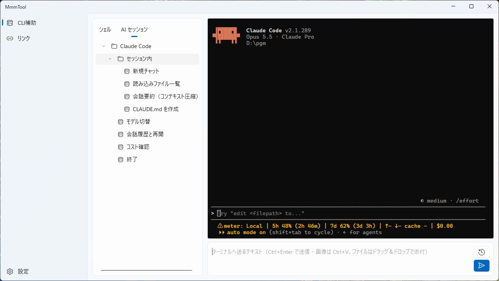

# MmmTool

**開発作業の「ちょっと面倒」を減らす、便利機能の詰め合わせ。**
タスクトレイに常駐して、必要なときにすぐ呼び出せます。作業の中で「これがあれば楽なのに」と思ったものを、1 つのアプリに少しずつ足していきます。

### いまできること

- **CLI補助** … Claude Code・Kiro をアプリ内のターミナルで動かし、よく打つコマンドをクリック 1 つで送信できます
- **クリップボード転送** … ファイルをクリップボード経由で別の PC へ渡します。送る側はドロップするだけ、受け取る側はボタン 1 つで保存できます
- **Backlog** … Backlog の共有ファイルの一覧を見て、ファイルをダウンロードできます
- **リンク** … よく開く URL・フォルダー・ファイルを階層に整理して、トレイのメニューからすぐ開けます
- **リマインダー** … 時刻になると、作業の邪魔をしない通知を画面の隅に出します

普段はタスクトレイにいるだけで、ウィンドウを閉じても常駐し続けます。作業を補助する機能は、これからも順に足していきます。

## ダウンロード

[Releases](https://github.com/Mimumumimu/MmmTool/releases) から zip をダウンロードして、展開するだけで使えます (インストール不要)。

### 必要なもの

- Windows 10 (1809) 以上 (x64)
- [.NET 10 Desktop Runtime](https://dotnet.microsoft.com/download/dotnet/10.0) (x64)
- [Windows App Runtime 2.5](https://learn.microsoft.com/windows/apps/windows-app-sdk/downloads) (x64)
- [Microsoft Edge WebView2 ランタイム](https://developer.microsoft.com/microsoft-edge/webview2/) (Windows 11 には標準で入っています)
- 日本語の音声 (リマインダーの読み上げを使うとき。日本語版の Windows には標準で入っています。外国語版の Windows では、設定の「言語と地域」で日本語を追加すると入ります)
- PowerShell 7 (任意。入っていればターミナルで優先して使います)
- WSL (任意。CLI補助で、WSL に入れた Claude Code・Kiro を使うとき。会話履歴の削除の補助スクリプトには、WSL の中に Python 3 が要ります。Ubuntu には標準で入っています)

ランタイムはアプリに同梱していません。.NET と Windows App Runtime は、入っていなければ `MmmTool.exe` を起動したときに案内のダイアログが出るので、そこからダウンロードしてインストールできます。

### 導入

1. zip を展開します。中に説明書 `README.txt` と、アプリ本体の `MmmTool` フォルダーがあります
2. `MmmTool` フォルダーの中の `MmmTool.exe` を開きます。ウィンドウは出ず、タスクトレイにアイコンが出ます

- `MmmTool` フォルダーは、好きな場所 (例: `D:\Tools\MmmTool`)へ移して使えます。ただし、**他の人が書き込めるフォルダーには置かないでください**(理由は「[データ保存場所](#データ保存場所)」)
- `Lib` フォルダーの中身を動かしたり、EXE の横へ移したりしないでください (起動できなくなります)

### 新しい版への入れ替え・アンインストール

- **入れ替え:** トレイの「終了」で MmmTool を終了し、新しい版の `MmmTool` フォルダーの中身を、今使っている `MmmTool` フォルダーに上書きコピーします。`Data` フォルダー (設定やリンクなど)は配布物に含まれていないので、そのまま残ります。フォルダー名は版が変わっても `MmmTool` のままなので、ショートカットなどもそのまま使えます
- **アンインストール:** MmmTool を終了してから、`MmmTool` フォルダーを丸ごと削除します。`%TEMP%\MmmTool\` が残っていたら、それも削除してください。Backlog の API キーを登録していたときは、Windows の資格情報マネージャー (「Windows 資格情報」の汎用資格情報 `MmmTool.Backlog`)から、その項目も削除してください

## 主な機能

### タスクトレイ常駐

- 起動時はウィンドウを出さず、トレイアイコンだけを表示
- トレイアイコンの左クリックでメインウィンドウを表示
- 右クリックでメニュー (リンク・終了)。Windows のダーク／ライト設定に合わせた配色
- ウィンドウの × / Alt+F4 はトレイへ退避 (終了はトレイメニューの「終了」だけ)
- 多重起動の防止 (同じ EXE を 2 つ目に起動すると「すでに起動しています」と表示して終了)

### CLI補助



- アプリ内のターミナル (ConPTY + xterm.js)。シェルは PowerShell 7 (`pwsh.exe`)があればそれ、無ければ Windows PowerShell
- ターミナルはタブで複数開けます (1 タブ = 1 つの CLI)。別のフォルダで Claude Code・Kiro を並行して動かせます。タブ名は、アプリで選んだ作業フォルダ名です (ターミナルの中で直接 `cd` しても、タブ名は変わりません)。同じフォルダのタブは、「＋」と作業ディレクトリの変更では開けません (ターミナルの中で直接 `cd` した場合は止められません)。入力欄と添付はタブごとです。定型コマンドと送信履歴は全タブで共通で、選んでいるタブへ送ります
- 初めて CLI補助を開いたときに、使うツール (Claude Code / Kiro。両方も選べます)と、動かす環境 (Windows (PowerShell)/ WSL)を選びます。選んだツールの定型コマンドが、ツールごとのフォルダーに入ります (あとで「定型コマンドを初期化…」から選び直せます)
- WSL でも動かせます。WSL を選ぶと、ターミナルは WSL (既定のディストリビューションのシェル)になり、作業ディレクトリ・添付ファイルのパスを WSL の形 (`D:\work` → `/mnt/d/work`)にして渡します
- 定型コマンドのツリー (「シェル」/「AI セッション」の 2 タブ)。クリックでターミナルへ送信
- 作業ディレクトリの変更ダイアログ (最近使ったフォルダの履歴 20 件)
- 下部の送信欄から複数行のテキストを一括送信 (Ctrl+Enter)
- 送信履歴 (起動中のみ・50 件。絞り込み可)
- 画像の添付 (Ctrl+V で貼り付け → JPEG で一時保存)、ファイルの添付 (ドラッグ＆ドロップ・貼り付け。コピーせず、元のファイルのパスを渡す。× で添付から外しても、元のファイルは消えません)
- 添付したファイルは、送信時に「参照してほしい」という指示文とパスを付けて送ります。指示文には「ファイルを変更するのは、指示で求められたときだけ」とも書くので、「このファイルを直して」と頼んだときだけ AI が直します
- 補助スクリプト「会話履歴の削除」 (Claude Code の会話履歴を矢印キーで選んでごみ箱へ。WSL では、Linux のごみ箱 `~/.local/share/Trash` へ移します。操作は同じです)。Kiro でも同じ操作で、全作業フォルダの履歴から選んで消せます (Kiro の公式コマンドで消すので、ごみ箱へは送らず、戻せません)
- Kiro には CLAUDE.md の作成 (`/init`)にあたるコマンドが無いので、「steering を作成」で、`.kiro/steering/` に steering ファイルを作るよう Kiro に頼む文を送ります

### クリップボード転送

- ファイルの内容をテキスト (JSON)にしてクリップボードに載せ、クリップボードを共有できる環境 (リモートデスクトップなど)の別の PC で、ファイルに戻します
- 送信: ファイルをドロップ領域にドロップするか、「ファイルを選択」で選びます。複数のファイルも一度に送れます (1 ファイルあたり 160 MB まで)。作成日時・更新日時も一緒に渡します
- 受信: 「クリップボードから保存」を押します。1 件は保存先を選ぶ画面で、複数はフォルダーを選んで保存します。同じ名前のファイルがあるときは、まとめて置き換える・まとめてスキップする・ファイルごとに決める、から選べます
- 結果は画面上部のメッセージに出ます。大きなファイルでも、処理中に画面は止まりません
- 設定の「機能のオン・オフ」でオフにできます

### Backlog

- Backlog の共有ファイル (ファイル画面の URL で示すフォルダー)の一覧を取り、ファイルをダウンロードします。ファイルの追加・削除は Backlog の公開 API で行えないので、「ブラウザで開く」で Backlog の画面を開いて行います
- 先に、設定ページで Backlog の API キー (Backlog の個人設定で発行したもの)を登録します。API キーは、Data フォルダーではなく、Windows の資格情報マネージャー (「Windows 資格情報」の汎用資格情報 `MmmTool.Backlog`)に保存します。設定ファイルには残りません。別の PC では、入れ直します
- 連携用パス (URL)は、Backlog のファイル画面の URL をそのまま貼ります (`https://スペース名.backlog.jp/file/プロジェクトキー/フォルダー`)。一覧を取得できたときに保存し、次に開いたとき入力欄へ戻します (履歴は持たず、最後の 1 件)
- API キーを送る先なので、`backlog.jp` / `backlog.com` / `backlogtool.com` 以外の URL は受け付けません
- ダウンロードは、保存先を選んでから通信し、受けながら書き込みます (大きなファイルでも、メモリを使い切りません)
- 結果は画面上部のメッセージに出ます。設定の「機能のオン・オフ」でオフにできます

### リンク

- リンク (URL・フォルダー・ファイル・実行ファイル)を、フォルダーと区切り線で階層に整理する編集画面
- ドラッグ＆ドロップで並べ替え、パスの種類を自動判定して表示、「開いて確かめる」
- トレイメニューの「リンク」から階層メニューで開く

### 通知ダイアログ

- 画面の隅に出る、フォーカスを奪わない常に最前面の通知ウィンドウ
- ドラッグで移動 (位置は保存)、クリックで閉じる、本文のリンクを開く

### リマインダー

- 日付指定・曜日指定 (曜日を選ばなければ毎日)のリマインダーを、時刻になったら通知ダイアログで通知
- 対応状態 (未対応・完了・スヌーズ)。未対応は毎分、スヌーズは設定した間隔 (既定 15 分)で再通知
- 通知の本文は 1 件 1 行。備考があれば「件名 (備考)」と出す
- 通知の読み上げ (リマインダーごとに選ぶ)。通知のたびに、「件名。備考。」を日本語の音声で読む (複数あれば「続いて。」でつなぐ)。Windows 標準の音声合成を使うので、日本語の音声が入っていない PC では読まれない
- 入力画面 (件名・日付または曜日・時刻・備考・リンク・通知の読み上げ)。親画面の上にモーダルで開く
- 一覧画面 (全リマインダーの表示・新規追加・編集・削除・コピーして新規追加・完全削除)
- メイン画面 (今日の対象の一覧と対応状態の切り替え)。トレイメニューの「リマインダー」と、通知のクリックで開く

### 設定

- サイドバー下部の「設定」ページ。項目は「機能のオン・オフ」・「リマインダーのスヌーズ間隔 (分)」 (5〜999、既定 15。範囲外は下限・上限に補正)・「読み上げの声・速さ」 (Windows の音声設定を開くリンク。読み上げの声と速さは、Windows の設定に従います)・「Backlog の API キー」
- 値を変えると即保存され、スヌーズ間隔は次の判定から反映 (`Data/AppSettings.json`)。API キーは入力欄からフォーカスが外れたときに、資格情報マネージャーへ保存します
- 機能のオン・オフ: 使わない機能をオフにすると、サイドバー・トレイメニューから消え、動作も止まります (すぐ反映。再起動は不要)。今は CLI補助・クリップボード転送・Backlog をオフにできます (CLI補助は、どれかのタブでターミナルが動いている間にオフにすると確認が出ます)。リンクとリマインダーはオフにできません

## 使い方

1. 起動するとタスクトレイにアイコンが出ます。左クリックでメインウィンドウを開きます
2. 左のメニューから機能 (CLI補助・リンクなど)を選びます
3. ウィンドウを × で閉じてもトレイに残ります。完全に終了するときは、トレイアイコンの右クリックメニューから「終了」を選びます (未保存の編集内容は破棄されます)

### CLI補助

| 操作 | 内容 |
| --- | --- |
| 左のツリーの項目をクリック | 定型コマンドを、選んでいるタブのターミナルへ送信 |
| タブの「＋」 | 作業ディレクトリを選んで、新しいタブを開く (ほかのタブが開いているフォルダは選べません) |
| タブの「×」 | 確認してから、そのタブのターミナル (と中の CLI)を終了して閉じる (最後の 1 つは閉じられません) |
| 左の一覧の右上の「⋯」→「定型コマンドを初期化…」 | 定型コマンドを既定の内容に作り直し、使うツール (Claude Code / Kiro)と動かす環境 (Windows / WSL)を選び直す (手で足したコマンドは消えます。すべてのタブのターミナルを起動し直します) |
| 送信欄で Ctrl+Enter | 入力したテキストを送信 |
| 送信欄で Ctrl+V (画像) | 画像を添付 |
| ファイルをドラッグ＆ドロップ (または、エクスプローラーでコピーして Ctrl+V) | ファイルを添付 (元のファイルのパスを渡す) |
| ターミナルのシェルが終了したあとにキー入力 | シェルを再起動 |

#### 定型コマンドの書き方

定型コマンドは `Data/CliCommands.json` で編集します。`shell`(シェルで打つコマンド)と `session`(AI エージェントのセッション内で打つコマンド)の 2 つのツリーです。`children` を持つ項目はフォルダー、`command` を持つ項目はクリックで送信するコマンドになります。手で直すときは、アプリを終了してから行ってください。

```json
{
  "environment": "windows",
  "shell": [
    {
      "label": "Claude Code",
      "children": [
        { "label": "起動", "command": "claude", "switchTo": "session", "focus": "input" }
      ]
    }
  ],
  "session": []
}
```

- `environment` … コマンドを動かす環境 (`"windows"` / `"wsl"`)。ファイルを作るときに選んだものが入ります。省略すると Windows です。環境を変えるときは、書き換えるより、左の一覧の右上の「⋯」メニューの「定型コマンドを初期化…」で選び直すのがおすすめです (既定のコマンドも、その環境向けに作り直されます)
- `switchTo` … 送信後に切り替えるタブ (`"shell"` / `"session"`)。省略すると切り替えません
- `focus` … 送信後のフォーカスの移動先 (`"terminal"` / `"input"`＝送信欄)。省略すると移しません
- コマンド中の `{AppDir}` は、送信時に EXE のあるフォルダーに置き換わります (引用符は付きません。フォルダーのパスに空白があっても動くよう、`"{AppDir}\tool.ps1"` のように、自分で引用符で囲んでください)。WSL では `/mnt/d/...` の形に置き換わるので、区切りは `/` で書きます (`"{AppDir}/tool.py"`)
- 既定の内容は、`CliCommands.json` が無いときだけ作られます。新しい既定のコマンドを反映したいときは、左の一覧の右上の「⋯」メニューの「定型コマンドを初期化…」を押してください (手で足したコマンドは消えます。ターミナルは起動し直します)

### クリップボード転送

| 操作 | 内容 |
| --- | --- |
| ファイルを「送信」のドロップ領域にドロップ (または「ファイルを選択」) | ファイルをクリップボードに載せる (複数可・1 ファイル 160 MB まで) |
| 「クリップボードから保存」 | クリップボードのファイルを保存。1 件は保存先を選ぶ画面、複数はフォルダーを選ぶ画面が開く |
| 同じ名前のファイルがあるとき (複数の保存) | 「ファイルを置き換える」「置き換えずスキップする」「ファイルごとに決める」から選ぶ |

別の PC で受け取るには、受け取る側でも MmmTool を開いて、「クリップボードから保存」を押します。

### Backlog

| 操作 | 内容 |
| --- | --- |
| 「連携用パス (URL)」に URL を入れて「一覧取得」 | 共有ファイルの一覧を表示 (フォルダーは除く)。取得できた URL は次回のために保存 |
| 「ブラウザで開く」 | 入力した URL を既定のブラウザーで開く (ファイルの追加・削除はここで) |
| 行の「ダウンロード」 | 保存先を選んで、ファイルを保存 |

### リンク

| 操作 | 内容 |
| --- | --- |
| 「リンクを追加」「フォルダーを追加」「区切り線を追加」 | 選択中のフォルダーの中 (末尾)、または選択中の項目の直後に追加。未選択なら最上位の末尾 |
| 「変更を破棄」 | 保存済みの内容を読み直す |
| ドラッグ＆ドロップ | 並べ替え・フォルダーへの移動 |
| 行を右クリック | その行のメニュー |
| Ctrl+S | 保存 |
| ツリーで Delete | 削除 (中身のあるフォルダーだけ確認あり) |

パスは手入力が基本で、「参照」からファイル・フォルダーを選ぶこともできます (`%USERPROFILE%` などの環境変数も使えます)。保存すると、トレイメニューの「リンク」にすぐ反映されます。

### リマインダーのメイン画面

トレイアイコンの右クリックメニューの「リマインダー」で開きます (開いていれば前面に出ます)。今日が対象のリマインダー (発動日が今日、または曜日指定で今日の曜日を含むもの)を時刻順に並べ、未対応 (未・スヌーズ)を上に、完了を下の「完了 (件数)」の折りたたみ (最初は閉じた状態)に分けて表示します。左端の縦線の色は状態 (未＝グレー / スヌーズ＝アンバー / 完了＝グリーン)です。開いたまま日付が変わると、新しい日の対象に切り替わります。位置と大きさを変えられ、次に開くとき同じ場所・大きさで出ます (初めて開くときは、メインモニターの右下。最大化・最小化はできません)。

| 操作 | 内容 |
| --- | --- |
| 「新規追加」 | 入力画面を開いて新しく登録 |
| 「一覧」 | 一覧画面を開く |
| 右端の「未 / スヌーズ / 完了」 | 今日の対応状態を切り替え (すぐ保存) |
| 件名をクリック | リンクがあれば開く (リンクのある行は件名の前にアイコンが付き、マウスを乗せると手の形になる) |
| 行を右クリック | リンクを開く (リンクのある行だけ) / 編集 / 削除 |

- 通知ダイアログの本文をクリックして閉じると、この画面が開きます。このとき、時刻を過ぎて未対応のものはスヌーズに進みます (気づいたとみなし、次はスヌーズ間隔の後に再通知)。× で閉じたときは進みません
- 「削除」は確認なしで削除します (一覧画面の「削除済みを表示」から編集して保存すると戻せます)

### リマインダーの一覧画面

全リマインダーを 日付 → 時刻 → 登録順 に並べます。曜日の列は、曜日指定なら「月火水」のように、曜日を選んでいなければ「毎日」と出ます。親の画面の上にモーダルで開き、大きさを変えられます。

| 操作 | 内容 |
| --- | --- |
| 「新規追加」 | 入力画面を開いて新しく登録 |
| 「過去の予定を表示」 | オンで日付が昨日以前の日付指定も表示 (既定はオフ。今日の分は時刻が過ぎていても表示) |
| 「削除済みを表示」 | オンで削除済みのリマインダーも表示 (半透明＋取り消し線) |
| 行をダブルクリック | 編集 |
| 行を右クリック | 編集 / コピーして新規追加 / 削除 (削除済みの行では「削除」の代わりに「完全削除」) |

- 削除済みのリマインダーを編集して保存すると、削除が取り消されます (開く前に確認があります)
- 「コピーして新規追加」は、日付・時刻・曜日・件名・備考・リンク・通知の読み上げを引き継いだ新規として入力画面を開きます (元のリマインダーは変わりません)
- 「完全削除」は元に戻せません (確認があります)

### リマインダーの入力画面

| 項目 | 内容 |
| --- | --- |
| 件名 | 必須。空のまま OK を押すと欄の下にエラーが出る (入力し直すと消える) |
| 日付を指定する | オンで日付 (カレンダーから選択)、オフで曜日 (月〜日を複数選択可)。曜日を 1 つも選ばなければ毎日通知 |
| 時刻 | 「時 : 分」を 24 時間で入力。時・分を押して直接打つ (2 桁で分へ移る)ほか、↑↓ キーやマウスホイールで増減 |
| 備考・リンク | 任意。リンクは URL・ファイル・フォルダーのパス (通知の件名から開ける)。備考は通知の本文に「件名 (備考)」と出る |
| 通知を読み上げる | オンにすると、通知のたびに「件名。備考。」を日本語の音声で読み上げる (既定はオフ)。未対応は毎分、スヌーズは設定した間隔で読まれる。Windows に日本語の音声が入っていないと読まれない |

OK で保存して閉じ、キャンセル (または ×)で保存せずに閉じます。開いている間は親の画面を操作できません。

## データ保存場所

実行フォルダ (EXE と同じ場所)配下の `Data` フォルダに JSON で保存します。手で修正するときは、アプリを終了してから行ってください (起動中はメモリ上の内容で上書きされることがあります)。

**置き場所の注意:** `Data/CliCommands.json` の定型コマンドは、クリックするとターミナルへ送られて実行されます。`Data` フォルダを、他の人が書き込めるフォルダーに置くと、そのコマンドを書き換えられて、任意のコマンドを実行されるおそれがあります。自分だけが書き込めるフォルダー (ユーザーフォルダーの下など)に置いてください。

| ファイル | 内容 |
| --- | --- |
| `Data/CliCommands.json` | CLI補助の定型コマンド。無ければ既定の内容で作成 |
| `Data/CliSettings.json` | CLI補助の最後の作業ディレクトリ・履歴 (20 件) |
| `Data/Links.json` | リンクの構成。無ければ空で作成 |
| `Data/Reminders.json` | リマインダー本体 |
| `Data/ReminderStates.json` | リマインダーの対応状態 |
| `Data/AppSettings.json` | アプリ共通の設定 (ウィンドウ位置、スヌーズ間隔など) |

### DB モード (複数の PC で共有)
既定の保存先は、上の JSON ファイルです (ローカルモード)。設定の `Database.Mode` を `SqlServer` にすると、リマインダーを SQL Server に保存して、複数の PC で共有できます (DB モード)。ローカルモードでは、DB に接続しません。

- 表は、リポジトリの `Sql/SqlServer/001_CreateTables.sql` で作ります。アプリが使うログインには、`dbo` スキーマの読み書き (`SELECT`・`INSERT`・`UPDATE`・`DELETE`)だけを与えます (詳しくは `docs/specs/database.md`)
- 接続の設定 (サーバー名・データベース名・ユーザー名など)は `Data/AppSettings.json` の `Database.*` に、パスワードは Windows の資格情報マネージャー (`MmmTool.Database`)に保存します。通信は常に暗号化します
- DB モードの最初の起動で、この PC をユーザーとして登録する画面が出ます (表示名と MAC アドレス。表示名の初期値は Windows のユーザー名です)
- 一覧に出るのは、宛先が自分・全員宛て・自分が作成したリマインダーです。通知は、宛先が自分と全員宛てのものだけです。DB モードでは、完全削除はできません (削除済みにするだけです)

- JSON として読めない (壊れた)ファイルは、`名前.broken-yyyyMMdd-HHmmss.json` に名前を変えて同じフォルダに退避し、新しく作り直します。退避したファイルは自動では消えないので、必要な内容を戻したら削除してください。

そのほか、次の場所にも実行時のファイルが作られます。

- `%TEMP%\MmmTool\session_日時\` … CLI補助で貼り付けた画像など、元がファイルではない添付 (ドロップしたファイルはコピーしないので、ここには入りません。タブを閉じるとき・終了時に削除。残ったものは 1 日たつと次回の添付時に削除。別の場所に置いた MmmTool とも共有します)
- WSL の `/tmp/MmmTool/session_日時/` … CLI補助を WSL で使うときの、貼り付けた画像の置き場所 (`%TEMP%` の代わり)。終了時には削除しません (WSL の /tmp は、systemd が有効なら WSL の起動のたびに空になります)。送信前に × で外した画像は、すぐ削除します
- WSL の `~/.local/share/Trash/` … WSL 版の「会話履歴の削除」で消した履歴の移動先 (Linux のごみ箱。戻すときは `files/` から元の場所へ移します)
- `Data\WebView2\` … ターミナルの画面 (WebView2)のキャッシュ (消しても、次に開いたときに作り直されます。他の人が書き込めると、キャッシュを書き換えられるおそれがあるので、`Data` フォルダと同じく、自分だけが書き込めるフォルダーに置いてください)
- `Data\Logs\` … エラーのログ (自動では消えません。例外のスタックトレースに、ユーザー名を含むパスが入ることがあります。ログを他の人に渡すときは、中身を確かめてください)

`%TEMP%` と WSL の中のファイルのほかは、すべて `Data` の下に作られます (EXE のフォルダの外には書きません)。ただし Backlog の API キーだけは、Data ではなく Windows の資格情報マネージャーに保存します。

## ライセンス

このプロジェクトは [MIT License](./LICENSE.txt) のもとで公開されています。

同梱している外部ライブラリ (NuGet パッケージを含む)のライセンスと通知の全文は、配布物の `MmmTool\Assets\Licenses\THIRD-PARTY-NOTICES.txt` にまとめています (発行のたびに、配布物に入るパッケージから自動で作ります)。リポジトリに直接入れているものは、次のファイルです。

- xterm.js (MIT License)… [`external/MmmSdk/MmmSdk.WinUI/Components/Terminal/Assets/xterm.LICENSE.txt`](./external/MmmSdk/MmmSdk.WinUI/Components/Terminal/Assets/xterm.LICENSE.txt)
- @xterm/addon-fit (MIT License)… [`external/MmmSdk/MmmSdk.WinUI/Components/Terminal/Assets/addon-fit.LICENSE.txt`](./external/MmmSdk/MmmSdk.WinUI/Components/Terminal/Assets/addon-fit.LICENSE.txt)

---

# 開発者向け

ここから下は、ソースコードからビルドする人・開発に加わる人向けの説明です。

## 技術スタック

- .NET 10 (`net10.0-windows10.0.19041.0`)
- WinUI 3 (Windows App SDK 2.5)
- CommunityToolkit.Mvvm
- CommunityToolkit.WinUI.Controls.Segmented (リマインダーの対応状態の切り替え)
- Microsoft.Extensions.Hosting (Generic Host による DI。設定・ログの既定は無効)
- WebView2 + [xterm.js](https://xtermjs.org/) 6.0.0 / addon-fit 0.11.0 (ターミナル描画)
- Win32 API の直接呼び出し (ConPTY、`Shell_NotifyIcon` によるトレイアイコンなど。WinForms には依存しません)
- 共有部品 [MmmSdk](https://github.com/Mimumumimu/MmmSdk) (Git サブモジュール)

## 開発環境

- .NET 10 SDK
- Visual Studio 2026 以降 (「WinUI アプリケーション開発」ワークロード)
- 実行には、上の「[必要なもの](#必要なもの)」のランタイムも要ります (フレームワーク依存の構成のため)

## 取得方法

共有部品 [MmmSdk](https://github.com/Mimumumimu/MmmSdk) を Git サブモジュール (`external/MmmSdk`)として取り込んでいます。clone するときはサブモジュールも一緒に取得してください。

```powershell
git clone --recurse-submodules https://github.com/Mimumumimu/MmmTool.git
```

すでに clone 済みで `external/MmmSdk` が空のときは、次を実行します。

```powershell
git submodule update --init --recursive
```

## ビルドと実行

構成は x64 のみです。

```powershell
cd MmmTool
dotnet restore .\MmmTool.slnx
dotnet build .\MmmTool.slnx
```

ビルドの共通設定はリポジトリ直下にまとめています (`external/MmmSdk` は SDK 自身の同名ファイルを使います)。

| ファイル | 内容 |
| --- | --- |
| `Directory.Build.props` | 全プロジェクト共通の設定 (Nullable・XML ドキュメントコメントの検査・コードスタイルのビルド時検査など) |
| `Directory.Packages.props` | NuGet パッケージのバージョン (中央パッケージ管理。csproj にはバージョンを書きません) |
| `.editorconfig` | コードスタイル。未使用の using などはビルド時に警告になります |

実行は Visual Studio で `MmmTool.slnx` を開き、`MmmTool` プロジェクト (起動プロファイル「MmmTool」)を F5 で起動します。起動してもウィンドウは出ず、タスクトレイにアイコンが出ます。

### 配布用の発行

Visual Studio では、ソリューション エクスプローラーで `MmmTool` プロジェクトを右クリックし、「発行」を選びます。発行プロファイル `win-x64`(構成は Release | x64)を選んで「発行」を押します。

コマンドで発行するときは、次のとおりです (Visual Studio と同じ結果になります)。

```powershell
dotnet publish .\MmmTool\MmmTool.csproj -p:PublishProfile=win-x64
```

発行すると、版ごとのフォルダ `MmmTool/bin/Release/publish/MmmTool_<版>/`(版は `Directory.Build.props` の `Version`。例: `MmmTool_0.1.0`)ができます。この版のフォルダをそのままコピーして配布します (インストーラーはありません)。

```
MmmTool_0.1.0\
  README.txt                ← 利用者向けの説明書 (必要なもの・使い方・データの場所・入れ替え方・変更履歴)
  MmmTool\                  ← アプリ本体 (これを D:\Tools\MmmTool などへコピーして使う)
    Assets\Licenses\LICENSE.txt               ← MmmTool のライセンス (MIT)
    Assets\Licenses\THIRD-PARTY-NOTICES.txt   ← 同梱しているライブラリのライセンスと通知の全文
```

アプリ本体のフォルダ名は版が変わっても `MmmTool` のままなので、コピー先のショートカットなどはそのまま使えます。ライセンスの文書はアプリ本体の中にあるので、`MmmTool` フォルダだけをコピー・再配布しても一緒に付いていきます。`README.txt` の元は `MmmTool/Distribution/README.txt`、`LICENSE.txt` はリポジトリ直下のもの、`THIRD-PARTY-NOTICES.txt` は発行のたびに、配布物に入るパッケージから自動で作ります。`Version` を上げずに発行し直すと、同じ版のフォルダに、前回のファイルを消さずに上書きします。前の版にだけあったファイルを残したくないときは、発行の前に版のフォルダを消してください。EXE の横のフォルダは `Assets`(配布物)と `Lib`(使っているライブラリの DLL)だけで、実行すると `Data`(アプリが書くもの)ができます。画面の定義は `MmmTool.pri` に入っています。`Lib` の DLL の場所は `MmmTool.deps.json` に書いてあるので、`Lib` を動かしたり、DLL を EXE の横へ移したりしないでください (起動できなくなります)。

## MmmSdk を更新するとき

SDK を直したら、先にサブモジュールの中 (`master` ブランチ)でコミット・push し、そのあと MmmTool 側で「新しいコミットを指す」変更をコミットします。

```powershell
cd external/MmmSdk
git switch master
# …変更をコミットして push…
cd ../..
git add external/MmmSdk
git commit
```

SDK の最新を取り込むときは、次を実行します。

```powershell
git submodule update --remote external/MmmSdk
```

## プロジェクト構成

| フォルダー | 内容 |
| --- | --- |
| `Plugins/MmmTool.<機能>.Core/` | 機能の、UI に依存しない層 (`net10.0`)。保存するデータ・保存先のインターフェース・処理を置き、JSON での保存は `Json/` に置く。機能は `Backlog`・`CliAssist`・`ClipboardTransfer`・`Links`・`Reminders` |
| `Plugins/MmmTool.<機能>/` | 機能の WinUI 3 ライブラリ。直下に機能の入口 (`<機能>Plugin`)・起動時の準備などのつなぎ、`Main/` に入口の画面、そのほかの画面は 1 画面 1 フォルダ (View・ViewModel・その画面の Windows 依存の処理)にまとめている |
| `MmmTool/Features/` | ホストが持つ機能のフォルダー (`Settings/`・`Debugging/`) |
| `MmmTool/Shell/` | 画面の枠。直下に DI への登録とナビゲーションの型、`Main/` にメインウィンドウ・サイドバー (タスクトレイの仕組みは SDK) |
| `external/MmmSdk/` | 共有部品 (Git サブモジュール)。設定ストア・ウィンドウ位置の保存・通知ダイアログ・確認ダイアログ・ファイル/フォルダー選択・擬似モーダル・多重起動の防止・タスクトレイ・時刻入力欄・IME 操作・添付の一時保存など |
| `docs/images/` | この README で使う画像 |

機能を足すときは、`Plugins/MmmTool.<機能>.Core/` と `Plugins/MmmTool.<機能>/` を作り、`MmmTool` から参照して、`App.xaml.cs` で `AddFeaturePlugin<<機能>Plugin>()` を 1 行呼びます。サイドバー・トレイメニューへの項目の追加と、起動時の準備は、機能の入口 (`<機能>Plugin.Register`)の中で登録します。機能を外すときは、参照と 1 行を削除します (使わない機能を含まない配布物を作れます。DEBUG ページはリマインダーを使うので、リマインダーを外すときは DEBUG ページも直します)。

## ドキュメント

設計と仕様は `docs/` にまとめています。

| ファイル | 内容 |
| --- | --- |
| [docs/architecture.md](docs/architecture.md) | 全体構成 (プロジェクト・フォルダ・DI・起動と終了・エラーの扱い)と、その決定の理由 |
| [docs/build-and-distribution.md](docs/build-and-distribution.md) | ビルドの共通設定・配布 (発行・配布物・ライセンス)と、その決定の理由 |
| `docs/specs/` | 機能ごとの仕様と実装メモ、決定の理由 (Backlog・CLI補助・クリップボード転送・リンク・リマインダー・トレイとメイン画面・設定・保存) |
| `external/MmmSdk/docs/` | 共有部品 (JSON の保存・設定ストア・通知ダイアログ・確認ダイアログ・タスクトレイ・ConPTY・ターミナル・コントロール)の仕様と、構成の決定の理由 |

## バージョン

現在のバージョンは 0.1.0 です (`Directory.Build.props` の `Version`。ファイル・アセンブリのバージョンは 0.1.0.0 になります)。変更履歴は、配布物の説明書 (元は `MmmTool/Distribution/README.txt`)の「変更履歴」に書いています。
